# AWS-Based Financial Risk Model Automation


Serverless automation that ingests risk models, runs regression/sensitivity/back-testing, and ships audit-ready PDF reports. Built to feel enterprise-grade while staying lightweight for demos and POCs.

## TL;DR
- Ingest models to S3, trigger a Step Functions state machine, run Lambda-based validations/back-tests, and drop reports back to S3.
- Opinionated dev loop: format, lint, type-check, test, then SAM deploy.
- Uses pandas/numpy/scikit-learn for computations; Jinja2 + ReportLab for templated PDFs.

# 📊 AWS Model Validation & Reporting Pipeline

## 🧩 Architecture & Flow

```mermaid
flowchart TB
  A[📦 Model Artifacts<br/>S3 Ingest Bucket] --> B[⏰ EventBridge<br/>Scheduled / Ad-hoc Triggers]
  B --> C[🧭 Step Functions<br/>Workflow Orchestration]

  C --> D[✅ Validation]
  C --> E[📈 Back-Testing]
  C --> F[🧪 Sensitivity Analysis]

  D --> G[Lambda Handlers<br>pytest-powered Assertions]
  E --> G
  F --> G

  G --> H[Report Builder<br>Jinja2 to PDF via ReportLab]

  H --> I[S3 Results Bucket]
  H --> J[Notifications<br>SNS / Email / Slack]
```



```text
Model Artifacts (S3 Ingest)
        ↓
EventBridge Trigger (Scheduled / Manual)
        ↓
Step Functions Orchestration
   ├─ Validation
   ├─ Back-Testing
   └─ Sensitivity Analysis
        ↓
Lambda Execution (pytest assertions)
        ↓
Report Generation (Jinja2 → PDF)
        ↓
Results Storage (S3) + Notifications
```

**Why it works**
- Event-driven ingestion + deterministic Step Functions flows with retries.
- Test-first Lambda handlers (pytest assertions) keep runs auditable.
- Jinja2 → ReportLab PDFs produce governance-friendly artifacts.
- S3-backed inputs/outputs with SNS/email/Slack notifications.

**Service layers**
| Layer         | Services                   |
| ------------- | -------------------------- |
| Ingestion     | S3                         |
| Triggers      | EventBridge                |
| Orchestration | Step Functions             |
| Compute       | AWS Lambda                 |
| Testing       | pytest                     |
| Reporting     | Jinja2, ReportLab          |
| Storage       | S3                         |
| Notifications | SNS / Email / Slack        |

## Quickstart
Requirements: Python 3.13+, Docker (for SAM builds), AWS CLI configured, AWS SAM CLI.

```bash
# Clone & enter
git clone <repo-url>
cd AWS-Based-Financial-Risk-Model-Automation

# Bootstrap virtual env
python3 -m venv .venv
source .venv/bin/activate
pip install -r requirements.txt
```

## Local Dev Loop
- Format: `black .`
- Sort imports: `isort .`
- Lint: `flake8 .` and `pylint src` (adjust path if needed)
- Type-check: `mypy src`
- Test: `pytest -q` (add `-n auto` for xdist; coverage with `pytest --cov`)

## Deploy with AWS SAM
```bash
# Build (uses Docker for Lambda layers)
sam build

# Local invoke example
sam local invoke RiskHandlerFunction --event events/sample.json

# Deploy (creates/updates stack)
sam deploy --guided
```

## Configuration
- **Environment**: `.env` for local overrides; Lambda env vars for cloud.
- **Inputs**: drop models to the ingest bucket/prefix.
- **Outputs**: reports and run artifacts land in the results bucket/prefix.
- **Schedules**: EventBridge rules trigger recurring test runs.

## Suggested Layout
- `src/` – Lambda handlers, orchestration clients, utilities.
- `tests/` – unit/integration tests (pytest + moto for AWS stubs).
- `templates/` – Jinja2 templates for PDF/HTML reports.
- `events/` – sample payloads for `sam local invoke`.

## Contribution Ritual
1) Run format/lint/type-check/tests before pushing.  
2) Keep infra templates and sample events in sync with code.  
3) Use conventional commits where possible.

## License
MIT (update if different).
